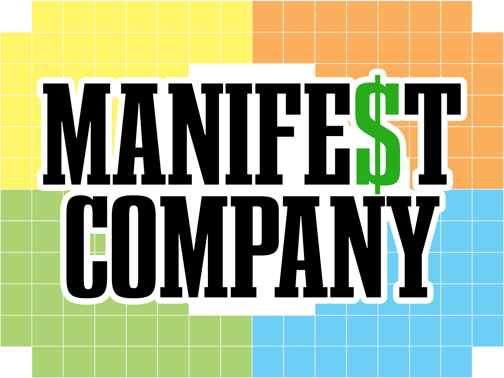
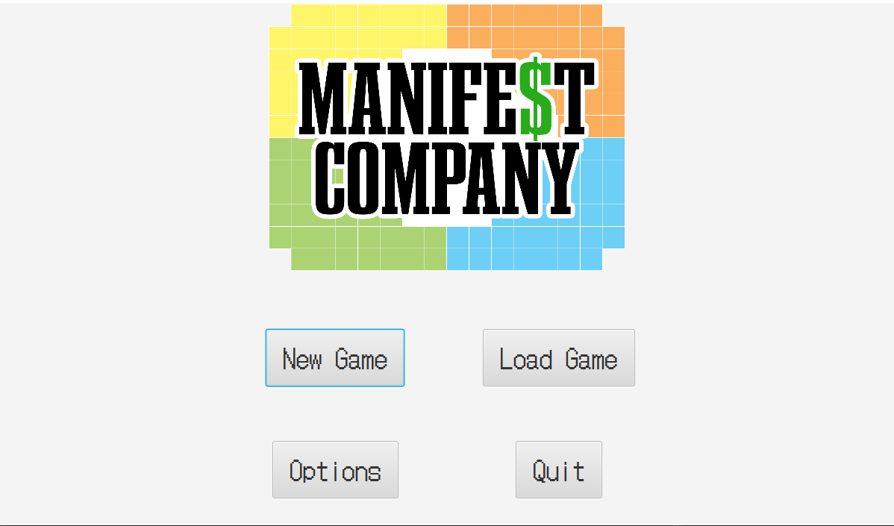
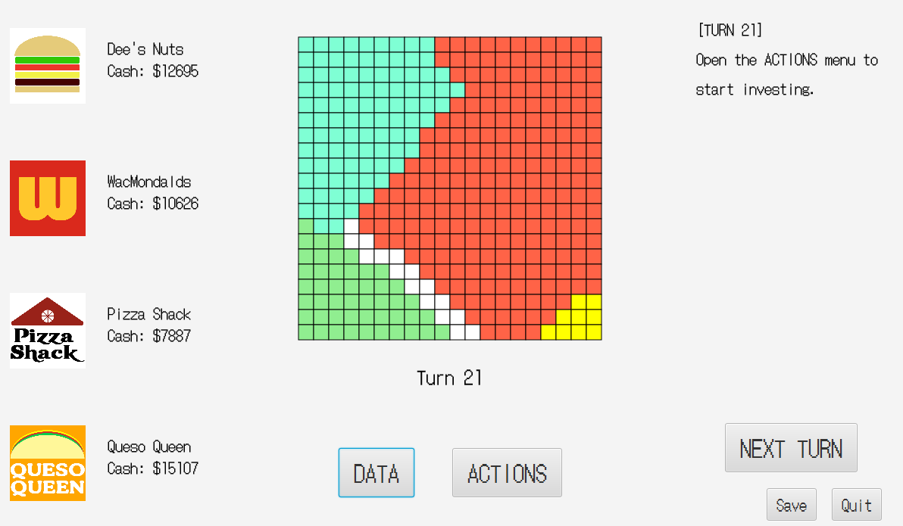
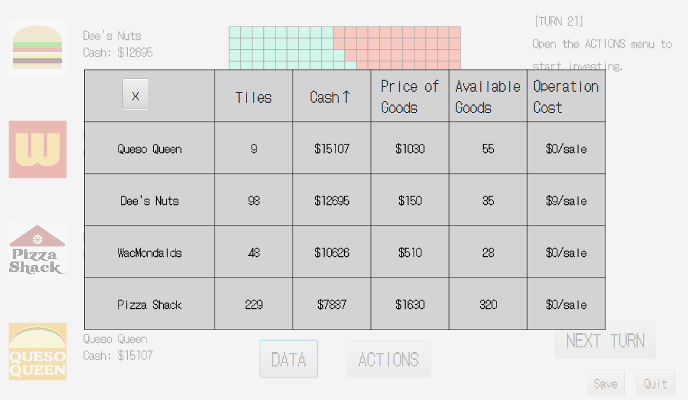
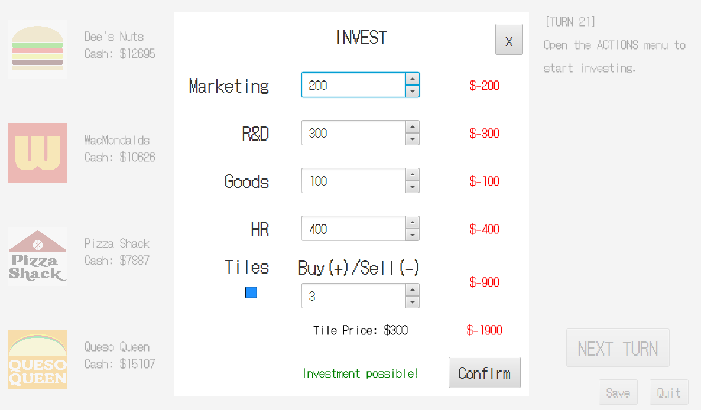
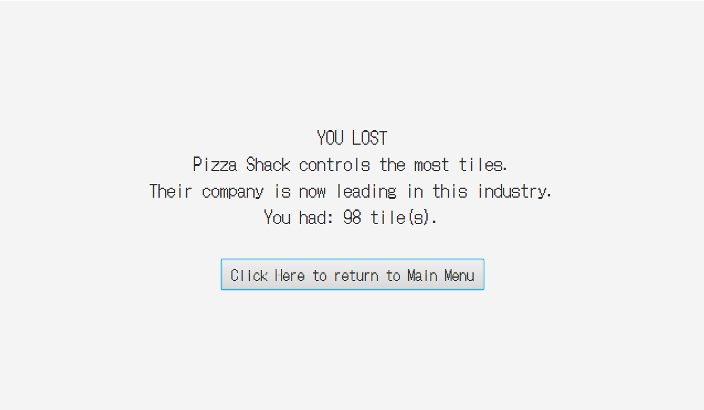

# Manifest Company 

  ## Table of Contents:
  1. [Description](#description)
  2. [Gameplay](#gameplay)
  3. [Screenshots](#screenshots)
  4. [Credits](#credits)

  ## Description 

Manifest Company is a business management game built in Java with JavaFX as a final project for CIT 5940. This program 
demonstrates the use of data structures in order to store and manipulate data in the program to perform
complex tasks. 

The game allows users to take control of a company and invest in its future in order to dominate
an industry among other CPU competitors.

  ## Gameplay

Upon booting up the game, the user is presented with a title screen and options to start a new game,
continue from a save file, or quit. Pressing New Game allows the user to pick a level, name your company,
and start playing. Pressing Continue allows the user to pick from the available save files to continue
progress in the game.

When the game boots up, the user is presented with a prompt on a grey screen. Clicking that prompt will
initialize the game and take the user to main game screen, with buttons to Show Data, take Actions, 
go to the Next Turn, Save, and Quit.

The Show Data button shows a chart of the statistics of each company. 

The Actions button opens a window to select investment values for certain sectors in a company. These sectors
are as follows:
- Marketing: increases the Multiplier granted to profits during calculation.
- Research & Development (R&D): increases the price of goods sold during a turn
- Goods: Increases the maximum capacity of goods able to be sold during a turn
- Human Capital (HR): Decreases the expenses (cost of operation) that cuts into profits during calculation 
- A user may also choose to invest in Tiles. Tiles are the primary score and goal of the gain, representing
company expansion and influence in an industry. Each tile costs $300, and a user may buy tiles to gain score,
or sell previously bought tiles to regain money in a pinch. 

After deciding on investments in the Action menu, a user may confirm these decisions and finalize them. Then,
changes will be reflected in the system, but only visible in the Data menu after the next turn progresses. A 
user may continue to invest after this point, but will be limited by the amount of cash their company currently owns.

The Next Turn button will advance the turn, taking the user's decisions and making decisions for the 3 other 
CPUs. These changes depend on the market demand and price, and eventually amount to either positive or negative
profit that goes into a company's Cash. After a turn completes, the next turn starts, showing a transition screen
with information about the current event that may change the market demand and price. After clicking the transition
screen, the user will return to the main game screen with updated statistics in the Data menu and be allowed
to continue making investing decisions.

After the user gets enough negative profit to have negative cash, they will go bankrupt and lose. This may
occur with the other CPUs as well, and if all CPUs go bankrupt, the user will win by default. If the board
becomes full, a winner is chosen as the company with the highest number of tiles.

At any time, a user may choose to save their progress or quit out of the game.

  ## Screenshots

* Main Menu

  

* Game Screen

  

* Data Menu

  

* Invest Menu

  

* Ending Screen

  

 ## Credits

Sung Je Moon: https://github.com/solar268
Antina Yeh: https://github.com/antinayeh
Peici Qiu: https://github.com/peiciqiu
Voravich Silapachairueng: https://github.com/voravichs
 

